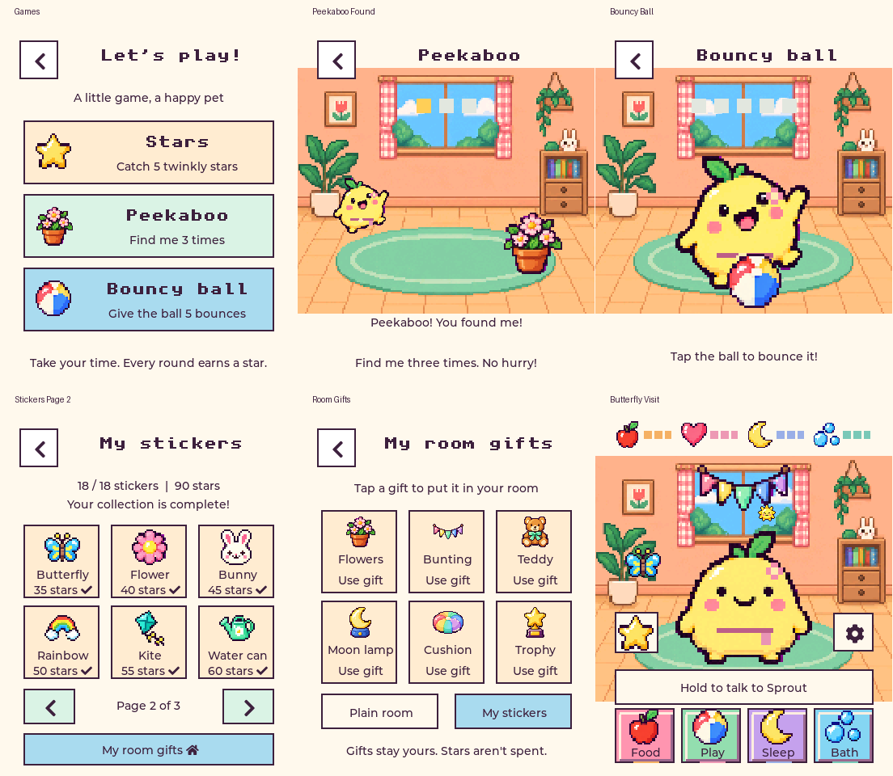

# Little Meadow

Play: [Bouncy ball v2](docs/bouncy-ball-v2.md) now launches to a new spot on every tap, with squash, spin, star trails and clear landing feedback. It waits between bounces so there is no rush.

Controls: [Larger back target and PWR sleep](docs/back-power-v1.md) adds an easier top-left back button and saved power-off on a short PWR press. These changes await flashing and physical button testing.

UI: [Speech and eating polish](docs/speech-polish-v1.md) adds a compact microphone, a tailed speech bubble and slower meals with correct coat colours.

Voice: [Tiny Sprout](docs/creature-voice-v2.md) adds a stronger creature voice and short, playful replies. Sprout can chat using the existing Mac mini voice stack. Hold the small microphone button or BOOT to talk without leaving the pet screen. It uses Haiku and occasionally offers a little comment. Rename it, toggle Little chats and check Wi-Fi in Options. See [voice controls, setup and rollback](docs/voice-v1.md).

A gentle touchscreen pet for the **Waveshare ESP32-S3-Touch-AMOLED-1.8 (original SH8601 / FT3168 board)**, built with ESP-IDF 5.3.5 and LVGL 9.



## Current version

Pet chat adds eight alternating spoken turns between two invited pets, with character personalities and shared captions. The same bubble redraw fix covers Home and care screens. See [Pet chat and speech bubbles](docs/pet-chat-v1.md). Firmware is built; USB installation is pending.

Care has distinct sound effects, and **Play → Music** offers three offline tunes plus a button to ask Sprout for an original melody. You can also say “make me a happy tune.” See [sounds, music, tests and rollback](docs/sound-music-v1.md).

Playtime adds Peekaboo, Bouncy ball, eighteen interactive wall stickers, six room gifts that can be placed together, butterfly visits and changing pretend window weather. See [playful rewards](docs/playful-rewards-v2.md) for the new treasure menu and room interactions. Existing progress counts toward every reward. See [controls, testing and rollback](docs/playtime-v1.md).

## Pixel-art v1

The pixel-art release implements the approved Tamagotchi-inspired direction: warm illustrated room, night room, an animated pixel sprout creature, colourful icon buttons and pixel headings. Existing gameplay and NVS saves are unchanged. Six coat colours and five growth stages remain supported.

The previous shaded-bunny version is preserved at Git tag **`vector-art-v1`**. To return the device to that version, run:

```sh
./backup/vector-v1/restore.sh /dev/cu.usbmodem101
```

This uses a separate verified binary bundle and does not erase NVS. For the old source in a separate folder, use `git worktree add ../pet-esp-vector vector-art-v1`. See [rollback instructions](backup/vector-v1/README.md).

## Playing

- **Food:** pick an illustrated snack; your pet eats it.
- **Play:** choose Stars (five catches), Peekaboo (find Sprout three times), or Bouncy ball (five taps). No timers or losing; the ball pauses under your finger.
- **Sleep:** a six-second nap restores energy. Back cancels the nap.
- **Bath:** pop five big bubbles.
- Tap your pet for a cuddle and a little hop.
- Each completed activity earns one saved star. Collect eighteen stickers, one every five stars, via the star button at home. The star opens a picture menu for **Stickers** and **Gifts**. Pick a sticker for the wall and tap it to replay its animation; six room gifts unlock at 10, 20, 30, 45, 60 and 90 stars and can all stay in the room together. Tap placed gifts for playful reactions. Stars are never spent. Growth adds a tuft, flower, scarf and golden badge at 10, 30, 60 and 100 stars.
- The matching coloured bars show food, happiness, energy and cleanliness. They also open their activities.
- **Food → Special treats** adds four permanent milestone recipes: Star cupcake (10 care stars), Berry pancakes (25), Rainbow jelly (50), Party cake (100). Each has matching whole/bitten poses, its own sound and voice reaction. Existing progress counts; stars are never spent. See [special foods](docs/special-foods-v1.md).
- **Options → My pet → Choose character** offers eight complete animated friends: Sprout, Cloud bunny, Pebble penguin, Peach kitten, Tiny dragon, Rosy pig, Larry and Osono. Arrows preview; Choose this character saves the appearance without changing name, progress or personality. Existing pets return to the original Sprout. See [characters](docs/five-characters-v1.md), [Rosy pig](docs/pink-pig-v1.md) [Larry](docs/larry-v1.md) and [Osono](docs/osono-v1.md). Each character has its own idle speech interests and tone, with recent-topic variation.
- The cog opens battery information, naming, Wi-Fi checks, the sound toggle and a 0–100% volume slider. Releasing the slider previews the level unless muted. Sound settings are session-local; volume starts at 100% after restart. **Start fresh...** opens a separate grown-up confirmation before replacing the pet. It resets growth, stars, stickers, room gifts and voice memory while preserving Wi-Fi setup. See [restart details](docs/start-fresh-v1.md).

Needs decay gently while powered on (one point per 3 / 4 / 5 / 6 minutes), stop at 20, and pause while powered off. There is no death, lost progress or punishment for leaving the toy. Each care action restores 30 points, capped at 100.

## Build and flash on this Mac

```sh
./scripts/device.sh build
./scripts/device.sh -p /dev/cu.usbmodem101 flash
./scripts/device.sh -p /dev/cu.usbmodem101 monitor
```

The helper selects the Python interpreter matching the existing build cache. On another machine, install ESP-IDF 5.3.x, source `export.sh`, then use `idf.py` from `firmware/`. The BSP and LVGL resolve through the component manager. The complete illustrated pet frames, icons, decorations and room images are compiled assets. Their generated header is checked in, so building does not require image-generation tools. Legacy sprite tooling and the assets partition remain available for future work.

## Test and render without the device

```sh
cmake -S tests/host -B /tmp/pet-host-build
cmake --build /tmp/pet-host-build -j8
mkdir -p docs/previews/playtime-v1/frames
(cd docs/previews/playtime-v1 && PET_CAPTURE_ANIMATIONS=1 /tmp/pet-host-build/pet_test)
python3 scripts/render_playtime_review.py
```

Uses the managed LVGL source installed by the firmware build, with mocked NVS/audio/power and actual LVGL pointer input. Tests cover decay boundaries, need floors, capped restoration, save/reload, all growth thresholds, activity completion, duplicate taps, cancelled feeding/naps, mute and repeated navigation. The PNG previews are renders of the actual C UI, not separate mockups. Pillow is needed only to convert the test's PPMs to PNG.

## Implementation

- `firmware/components/ui/ui.c`: screens, animation and activities; one LVGL timer owns the pet's periodic updates.
- `firmware/components/ui/pixel_pet.c`: the 72 × 72 complete illustrated pet frames, coat tinting and flash-backed icons.
- `art/pixel-v1/`: approved concept. `art/sprite-v3/`: original Sprout and room artwork. `art/characters-v1/`: eight independent complete characters, 208 frames and source prompts. `art/playtime-v1/`: new sticker and decoration source atlases, compiled previews and prompts. Packing scripts live in `scripts/`.
- `firmware/components/pet_state/`: backwards-compatible NVS pet blob. Previously unused `evolution_progress` stores care stars; no struct layout change.
- `firmware/components/audio/`: one asynchronous speaker worker for speech and chirps, plus gated microphone capture; mute is session-local.
- `firmware/components/voice/`: Wi-Fi, pet-scoped WebSocket protocol and queued voice turns.
- `firmware/components/renderer/`: BSP display/touch initialization and retained legacy sprite renderer.
- `docs/little-meadow.md`: design decisions, validation and limitations.

ESP-NOW multiplayer, breeding, IMU gestures and RTC synchronization remain unimplemented; the finished play loop is single-device.

## Recovery

The firmware that was on the connected device before this update is backed up locally at `backup/2026-09-19/pre-pet-flash.bin` (16 MB). See that folder's README for restoration. Flashing the pet does not erase NVS; valid existing pet identity, genes and progress are retained.
