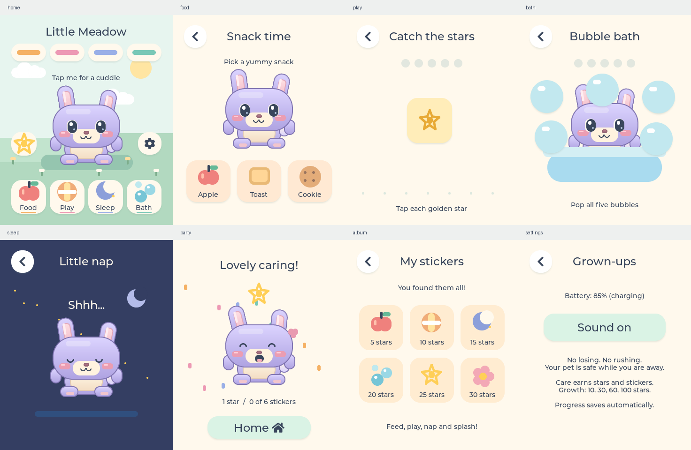

# Little Meadow

A gentle touchscreen pet for the **Waveshare ESP32-S3-Touch-AMOLED-1.8 (original SH8601 / FT3168 board)**, built with ESP-IDF 5.3.5 and LVGL 9.



## Playing

- **Food:** pick an illustrated snack; your pet eats it.
- **Play:** tap five golden stars. Each waits for you; there is no timer or losing.
- **Sleep:** a six-second nap restores energy. Back cancels the nap.
- **Bath:** pop five big bubbles.
- Tap your pet for a cuddle and a little hop.
- Each completed activity earns one saved star. Collect six stickers, one every five stars, via the star button at home. Growth adds a tuft, flower, scarf and golden badge at 10, 30, 60 and 100 stars.
- The matching coloured bars show food, happiness, energy and cleanliness. They also open their activities.
- The cog opens battery information and the sound toggle. There is no destructive reset button in the child-facing UI.

Needs decay gently while powered on (one point per 3 / 4 / 5 / 6 minutes), stop at 20, and pause while powered off. There is no death, lost progress or punishment for leaving the toy. Each care action restores 30 points, capped at 100.

## Build and flash on this Mac

```sh
./scripts/device.sh build
./scripts/device.sh -p /dev/cu.usbmodem101 flash
./scripts/device.sh -p /dev/cu.usbmodem101 monitor
```

The helper selects the Python interpreter matching the existing build cache. On another machine, install ESP-IDF 5.3.x, source `export.sh`, then use `idf.py` from `firmware/`. The BSP and LVGL resolve through the component manager. The current UI draws native vector shapes; it does not need generated sprite art. Legacy sprite tooling and the assets partition remain available for future work.

## Test and render without the device

```sh
cmake -S tests/host -B /tmp/pet-host-build
cmake --build /tmp/pet-host-build -j8
(cd docs/previews/little-meadow && /tmp/pet-host-build/pet_test)
python3 tests/host/render_previews.py
```

Uses the managed LVGL source installed by the firmware build, with mocked NVS/audio/power and actual LVGL pointer input. Tests cover decay boundaries, need floors, capped restoration, save/reload, all growth thresholds, activity completion, duplicate taps, cancelled feeding/naps, mute and repeated navigation. The PNG previews are renders of the actual C UI, not separate mockups. Pillow is needed only to convert the test's PPMs to PNG.

## Implementation

- `firmware/components/ui/ui.c`: screens, vector illustration, animation and activities; one LVGL timer owns the pet's periodic updates.
- `firmware/components/pet_state/`: backwards-compatible NVS pet blob. Previously unused `evolution_progress` stores care stars; no struct layout change.
- `firmware/components/audio/`: quiet, asynchronous codec chirps; mute is session-local.
- `firmware/components/renderer/`: BSP display/touch initialization and retained legacy sprite renderer.
- `docs/little-meadow.md`: design decisions, validation and limitations.

ESP-NOW multiplayer, breeding, IMU gestures and RTC synchronization remain unimplemented; the finished play loop is single-device.

## Recovery

The firmware that was on the connected device before this update is backed up locally at `backup/2026-09-19/pre-pet-flash.bin` (16 MB). See that folder's README for restoration. Flashing the pet does not erase NVS; valid existing pet identity, genes and progress are retained.
