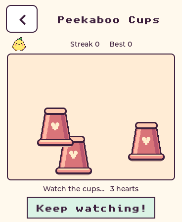
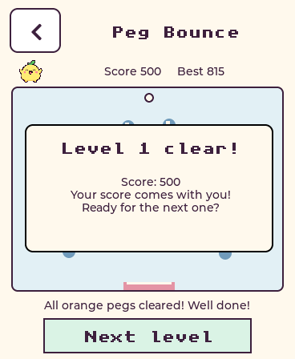

# Arcade levels

Follow-up to `pet-arcade-v1.1`; keep that tag as the firmware restore point.

## Cups

The menu and game now use the same illustrated inverted cup: a tapered coral
body, dark outline, shaded side, cream heart and wide rim. All three cups remain
identical so the hidden pet can only be followed through the shuffle. The cups
are drawn using small LVGL shapes and do not add a bitmap asset library.

## Peg Bounce

- Drag left/right across the board to aim through 246 degrees, including upward
  shots. The launcher speed is 250 pixels/second. Shots can arc above the board
  and come back; the old top-wall bounce is removed. The dotted preview follows
  gravity and side-wall reflections over a longer flight.
- Every bucket catch returns one ball, with an explicit `+1 ball` message. There
  is no longer a three-catch limit. A catch still awards 100 points.
- Clear all 11 orange pegs to finish a level; blue pegs may remain. The current
  shot finishes first so its bucket catch and points are counted.
- Next level generates a new seeded board, carries the score and supplies at
  least five balls. Spare-ball bonus remains 150 points per ball.
- Running out of balls before clearing orange ends the run. Play again starts
  at level one with zero score, while the saved best score remains.

## Tilt Garden

Each garden has a 45-second timer and a finite star target. Garden one needs five
stars; later gardens add one star up to eleven, and add a rock every two gardens
up to six. Rocks have seeded positions and mirrored arrangements. The established
tilt sensitivity and damping are unchanged, and touch control remains available.

Catch all the stars to unlock Next garden. The score carries forward, the marble
returns to the centre, and the new garden gets a fresh timer. The transition
pauses the solo timer and requires a tap, so a child can see the achievement.
Missing the target ends the run; Play again resets score and level. High scores
are saved before moving to the next level and when leaving a solo game.

## Multiplayer and compatibility

Peg Bounce and Tilt Garden both support progression within a three-minute score
challenge. The challenge clock includes transitions; each garden still has its
own 45-second deadline. Players can finish earlier by losing their run. Both
devices use the same seeded sequence of layouts. Memory and Pet chat retain
their existing rules.

These rules advertise `games: 2`. Gateway `f61417a` only enables arcade invitations
for that version, avoiding matches against older aiming/scoring rules. Both
physical pets must be updated for the new arcade multiplayer. The gateway allows
up to 200,000 Peg Bounce points or 50,000 Tilt Garden points, with existing type,
increment, duration, round-ID, turn and durable-reward checks.

## Validation

- 400-seed engine tests under AddressSanitizer and UndefinedBehaviorSanitizer.
- Actual simulated shots hit isolated pegs at both upper corners; upward shots
  retain their trajectory above the top edge.
- Nine consecutive bucket catches return a ball every time. Last-ball orange
  clearance advances with blue pegs remaining; score persists into a new level.
- Ten gardens advance with retained scores and fresh timers. Deadline and
  three-minute challenge expiry remain effective during transitions.
- Full host UI tests pass with direct drawing and 16-row partial refresh, with
  real taps through Next level/Next garden and Play again.
- 113 gateway tests cover new duration/score ranges and rejection of old rules,
  alongside existing memory, voice, authentication and multiplayer checks.

Rollback: firmware `pet-arcade-v1.1`; gateway `f2c54ed`. The deployed pre-levels
gateway image is saved as `esp-gateway:before-arcade-levels`, with changed sources
under `~/pet-arcade-levels-backup`. Keep NVS, device identity headers, environment
and the playdate database when restoring.
