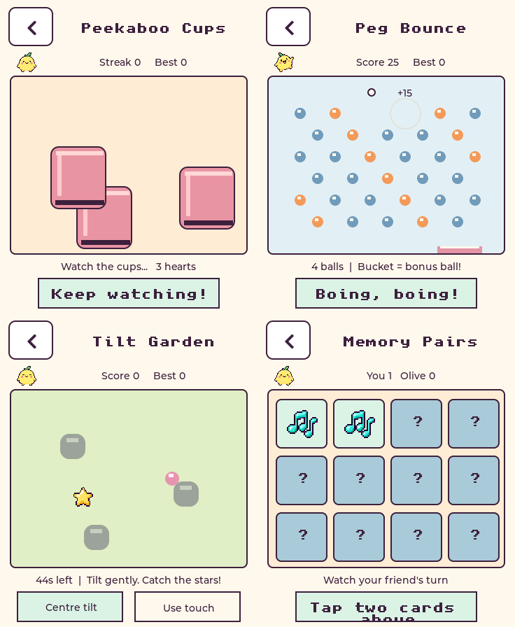

# Little Meadow arcade v1

The Games menu now offers four games. Existing music, pets, voices, care,
collectibles and Pet chat remain available. All eight characters fit.

| Game | Controls and scoring |
| --- | --- |
| Peekaboo Cups | Watch the pet hide, follow three shuffling cups, then tap a cup. Three hearts; faster shuffles as the streak grows. Record is the best streak, also saved when leaving early. |
| Peg Bounce | Drag anywhere on the board to aim, then press Launch. Five balls, 33 pegs, visible bounces, floating points and a moving bucket. Blue pegs give 10, gold 50, with 5 extra per earlier hit in that shot. The bucket gives 100 and up to three extra balls. Clearing the board adds 150 per remaining ball. |
| Tilt Garden | Hold comfortably and start; this centres the marble controls. Tilt gently to collect 100-point stars around three rocks for 45 seconds. Centre tilt recalibrates; Use touch provides a hold-and-drag alternative. |
| Memory Pairs | Twelve cards, six picture pairs. Tap two; mismatches remain visible briefly. No solo time limit. Each pair gives 100, with up to 600 extra for accuracy: 50 less per turn beyond the perfect six. Score never falls below 600 on completion. |

Every completed solo game gives a care star and happiness. Scores are saved in a
separate `pet_arcade` NVS namespace, bound to the pet ID; a fresh pet starts with
fresh records. The existing Pet blob is unchanged. Record and care saves retry
without giving duplicate rewards. Talking and music are paused during a game.

## Multiplayer

Home Wi-Fi multiplayer offers Peg Bounce, Tilt Garden, Memory Pairs and Pet chat.
Both players press Ready, then a three-second countdown starts the round.

- Peg Bounce compares final scores on the same board; Tilt Garden compares scores
  on the same seeded star course. Each device runs its physics locally.
- Memory uses a shared server-owned deck. Only revealed or matched cards leave
  the server. A match keeps the turn; a mismatch passes it to the friend.
- Both pets receive the existing durable playdate reward on completion. The
  database transaction succeeds before completion is published. Replay requires
  both players, creates a new round ID, and resets readiness.
- Leaving or disconnecting ends an arcade room. Unfinished/time-expired rounds
  give no multiplayer reward. Peg and tilt scores have type, range, increment
  and minimum-duration checks; these are friendly household games, not a
  server-replayed competitive leaderboard.
- New games require both devices to advertise `games: 1`. Older firmware can
  still use Pet chat and the legacy ball protocol. Legacy game code remains for
  rollback/compatibility but is absent from the new Games menu.

The gateway is commit `f2c54ed` in claude-esp. No Butler model configuration,
LLM calls or voice settings change for these games.

## Hardware and space

This board has 16 MiB physical flash, but its current app partition is 3 MiB.
The second-device image is approximately 2.63 MiB, leaving about 380 KiB (12%) in
that app partition. The arcade update adds about 16 KiB over voice-choice-v1.
Static DIRAM use is 240,883 bytes, leaving 100,877 bytes, a 1,512-byte increase.
The simulation allocates no heap; the UI reuses the pet artwork and existing
collectible icons. The board's 8 MiB PSRAM remains available for existing graphics
and audio buffers. No character removal, asset repartition or NVS erase is needed.

Tilt uses the onboard QMI8658 accelerometer, like the original Waveshare
Gravitysphere game. Portrait axes are screen X = -sensor Y, screen Y = sensor X.
The driver uses +/-2g at 125 Hz, filters readings and subtracts the starting
orientation. Read failures switch to touch control.

Sources: [Waveshare Gravitysphere](https://github.com/waveshareteam/ESP32-S3-Touch-AMOLED-1.8/blob/main/firmware/brookesia/components/Gravitysphere/Gravitysphere.cpp),
[QMI8658C datasheet](https://files.waveshare.com/wiki/common/QMI8658C.pdf).

## Validation and rollback

- Host UI suite: direct drawing and 40-row partial refresh, all four menus and
  games, high scores, save failures, care reward retry, multiplayer readiness,
  hidden cards, turns and results. Previews above are rendered from the real UI.
- Pure engine: 400 seeds under AddressSanitizer and UndefinedBehaviorSanitizer;
  cup permutations/lives, perfect and mistake-heavy memory rounds, deterministic
  peg time steps/termination, tilt bounds/timing, valid score increments.
- Gateway: 112 tests including real two-WebSocket Peg Bounce and Memory rounds,
  score rejection, hidden cards, replay, disconnects and reward-save retry.
- Separate ESP-IDF builds preserve each device's own identity header.

Restore firmware code using `pet-voice-choice-v1` (`4c07235`), or the pre-arcade
repository state `51955d4`. Rebuild using the matching private device header and
flash without erasing NVS. Each board has its own pet ID and credentials.
Restore the gateway source from `ac0a195`; the previous deployed image is tagged
`esp-gateway:before-arcade`, and its changed source is backed up under
`~/pet-arcade-backup` on the Mac mini. Preserve environment and playdate database.

Physical feel, tilt orientation in the hand, touch targets, audio balance and
two-device gameplay still need a hands-on acceptance pass; automated tests cannot
establish those qualities.
