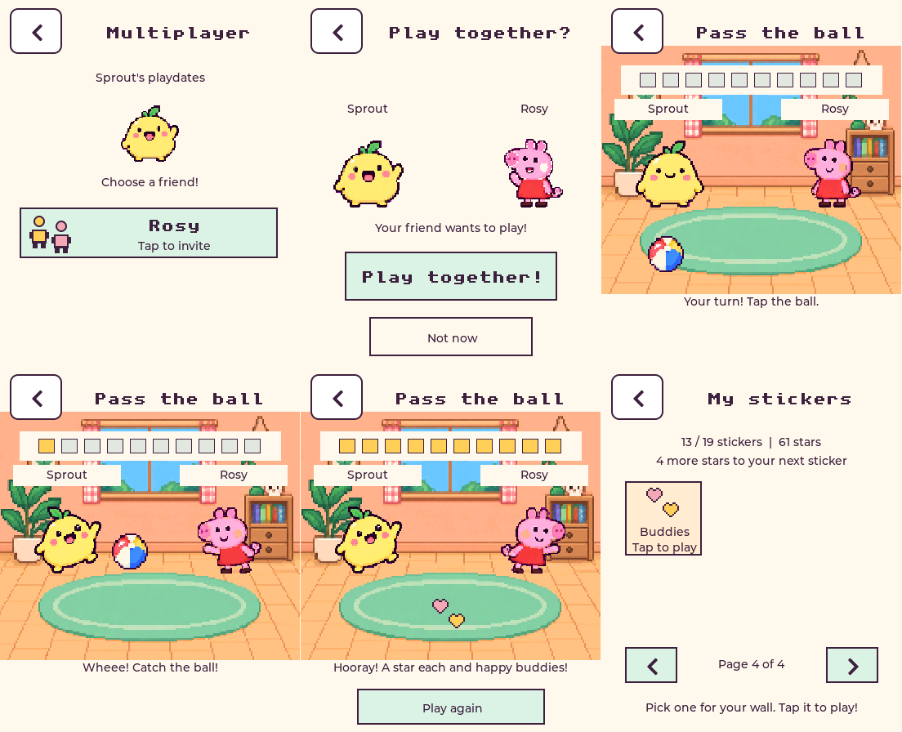

# Home Wi-Fi playdates

Open **Play → Multiplayer on both pets**. Tap your friend's name; they choose
**Play together** or **Not now**. Both pets appear in the same playroom. Tap the
ball when it is your turn; it flies to your friend. Ten alternating passes earn
one care star and happiness for each pet. A first completed friendship unlocks
**Buddies** on sticker page 4. This interactive pair of hearts can be placed on
the wall and replayed. Both players choose **Play again** for another round.
Back leaves; PWR leaves before sleeping. There are no missed-turn penalties.



The shared room reuses the existing painted room and complete character frames.
Both characters have independent buffers in PSRAM. Voice is paused on the
Multiplayer screen; BOOT does not record another player's speech. Voice resumes
normally after leaving. No models or speech services are used for playdates.

## Gateway and reliability

The existing gateway has a dedicated `/play` WebSocket on port 8770. Voice stays
on `/ws`. Wi-Fi remains owned by the voice component. The game coordinator is
`claude-esp/gateway/esp_gateway/playdates.py`, with tests in `test_playdates.py`.
Explicit device-token scopes and `PET_PLAYDATE_GROUPS` restrict discovery and
invitations to registered household devices. Presence starts only when the
Multiplayer menu opens. Connections carry versioned small pet snapshots, never
microphone audio or voice history. One live game connection per device is allowed.

The server owns invitation IDs, room IDs, pass sequence and turn. Repeated,
old, premature or out-of-turn taps do not advance the round. Invitations expire
after 30 seconds. Lost peers get a 45-second reconnect grace after disconnect;
there is no game turn timer. Device heartbeats detect a silent connection in
18 seconds. A server restart ends unfinished rooms but retains earned rewards.

SQLite `/data/playdates.sqlite3` lives in the Docker volume
`esp-gateway_pet-playdates`, with WAL and FULL synchronization. Completing a
round commits both reward receipts and deduplicated friendship entries in one
transaction before publishing completion. The server delivers one outstanding
receipt at a time in increasing ID order. It retains receipts until acknowledged.

The device saves the star, happiness, friends and receipt in the same atomic
Pet blob, then acknowledges. On save failure it retries; after a restart it
acknowledges an already-saved receipt without granting another star. Pet ID and
device account scope prevent a fresh pet inheriting an old pet's reward.
The schema-1 struct stays byte-for-byte unchanged. Previously unused inventory
bytes 0–7 hold the little-endian receipt ID and byte 8 marks it with 215.
Friendship totals and the eight recent friends use existing social fields.
The full friendship set is retained by the server, so an evicted recent friend
cannot become a new friendship again. Other inventory slots keep their meanings.
Do not remove/replace the durable SQLite ledger during routine deployment.

## Second device setup

The first board is `3c:dc:75:6e:31:04`. Its existing account and token are retained.
A new board must be verified as the same Waveshare ESP32-S3 Touch AMOLED 1.8.
After reading its actual MAC through esptool:

```sh
python3 scripts/provision_playmate.py --mac AA:BB:CC:DD:EE:FF
```

This creates a separate virtual-pet account and a separately scoped token,
registers household membership, and writes a mode-600 header under ignored
`firmware/private/`. It never copies the first pet's save or memories. Restart
the gateway to load registration. Build with the exact command printed by the
script, in the per-MAC build directory, then flash that directory to the verified
board's own USB port. Leave NVS intact. Credentials are bound to the physical MAC;
flashing a build intended for a different board cannot authenticate as that pet.

The new pet has its own identity/name/progress and Butler memory namespace.
**Options → My pet** and **Name** can distinguish two freshly named Sprouts.
The provisioning script does not automatically flash or restart services.

## Validation and remaining hardware check

The gateway suite has 61 passing tests, including real WebSocket framing,
explicit invitation acceptance, crossed invitations, household boundaries,
turn/sequence validation, duplicate taps, replay, disconnect/reconnect/expiry,
wrong receipt acknowledgements, durable receipts across server restart, and a
failed transaction that awards neither player. Eighteen Butler tests cover
pet-scoped behavior and independent friendship-sticker unlocking.

The full host UI suite checks real touch targets, no double-pass while awaiting
the server, BOOT suppression, both complete sprite buffers for all 49 character
pairs, save failure/retry, reboot/duplicate receipt handling, stale-pet rejection,
friendship sticker use, and Back. Existing games, care, music, voice controls,
character selection and saved data regressions remain covered.

Only one physical board is currently attached. Physical two-board invitation,
ball latency, Wi-Fi loss, sleep/reconnect, separate voice memories and sound
acceptance must be checked after provisioning and flashing the second board.
A simulated client or a single board does not complete that acceptance check.

Rollback firmware: `play-music-v1`; new friendship/receipt fields are ignored by
that version, and the buddy wall sticker is hidden until returning to multiplayer
firmware. Do not erase NVS. Gateway rollback image: `esp-gateway:before-playdates`;
source/compose backup: `~/pet-playdates-backup`. Preserve the reward volume even
when temporarily running the older gateway.

## Deployment — 2026-09-20

Firmware `multiplayer-v1.1` (`4f48508`) is installed on the verified first board
via `/dev/cu.usbmodem101`, with all flash hashes verified. The application uses
`0x27fdc0` bytes (17% app partition free). Moving the pair's buffers to PSRAM
leaves 102,893 bytes unassigned in the static DIRAM report before runtime
allocations. Boot capture identifies Olive (`6266ea62beb19b67`), restored at
stage 3 with saved needs, and reaches the normal ready state without a panic.
No NVS erase or reset-to-fresh was performed.

A rapid USB reboot exposed a clean-close retry gap in the ESP WebSocket client.
Version 1.1 enables clean-close reconnection and clears stale connection state.
The first device authenticated to both voice and playdates at 14:20:45 UTC;
a subsequent deliberate quick reboot recovered the game connection at
14:21:25 after the old socket expired. This verifies the real firmware retry
path, rather than only a simulated socket.

Gateway commit `956a04d` is deployed, with all 61 tests passing inside the
production container against the deployed modules. Butler commit `4d25586`
is deployed and healthy; all 18 tests pass there. The production game ledger
had zero reward rows after these checks: simulated tests did not award real
pet stars. Only the first physical board is registered so far.

Logs: `/tmp/pet-multiplayer-build.log`, `/tmp/pet-multiplayer-flash.log`,
`/tmp/pet-multiplayer-serial.log`, `/tmp/pet-mp-host-test.log`,
`/tmp/pet-mp-gateway-live-tests.log`, `/tmp/pet-mp-backend-live-tests.log`,
`/tmp/pet-mp-reboot-status.log` and `/tmp/pet-mp-final-connections.log`.
