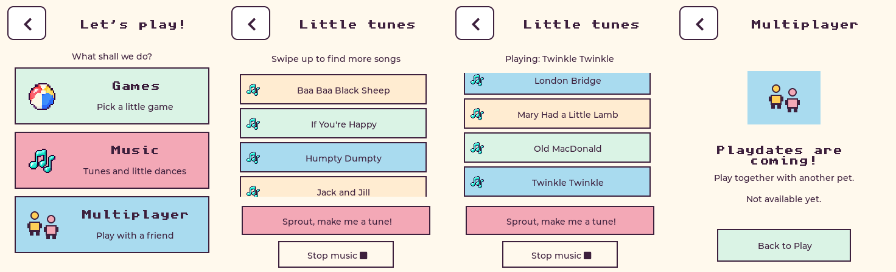

# Play menu and downloaded MIDI songs

**Play** now opens three large illustrated choices: **Games**, **Music** and
**Multiplayer**, matching the Stickers/Gifts menu. Games contains Stars,
Peekaboo and Bouncy ball. Back returns from a game to Games, then to Play.
Multiplayer is explicitly a coming-soon page; the home Wi-Fi implementation
is still described in [the proposal](multiplayer-v1-plan.md).

**Music** replaces the three demo patterns with all nine user-supplied MIDI
songs in [the library](../assets/music/README.md). Swipe the song list to
browse; Stop and the existing AI composition button stay visible. Playback
ends naturally, and Stop, leaving Music, mute, Talk/BOOT and speech interrupt
it without resuming stale audio. Music does not award care stars.

MIDI notes are compiled into flash-resident spans with tempo, sustain,
polyphony, velocity and instrument families. Playback synthesizes short PCM
buffers; complete song recordings are never loaded into RAM. Drum sounds
and a bounded compressor keep dense arrangements manageable on the small
speaker. This is a toy-instrument rendition rather than a full GM soundfont.

Validation: all nine full songs rendered with bounded peaks, exact durations,
silent tails and deterministic timing across buffer boundaries; the real audio
owner passes cancellation and speech-priority tests. Import tests cover tempo
changes, sustain, overlapping notes, drum release and the 64-voice bound.
The full host UI/gameplay suite passes, including real touch scrolling without
accidental song selection, all nine song buttons and enlarged Back targets.
Seventeen backend tests pass with the updated pet-only menu description.

Rollback firmware: `larry-v1`. This change does not alter the saved pet schema
or require erasing NVS. Source MIDI files and the importer make the library
reproducible. The existing Haiku model and pet voice are unchanged.

## Deployment — 2026-09-20

Firmware `play-music-v1` (`7d52424`) built successfully with ESP-IDF 5.3.5.
Application size is `0x27ddf0`, leaving 17% of the 3 MiB app partition free.
USB flash on `/dev/cu.usbmodem101` completed with all hashes verified, without
erasing NVS. The device reconnected to the gateway at 13:48:13 UTC. Physical
speaker sound and touch feel still need the user's listening/play test.

Backend `d123f10` is deployed on Ron's Mac mini; Butler is healthy and all
17 tests pass against the deployed code. Logs are in `/tmp/pet-midi-build.log`,
`/tmp/pet-midi-flash.log`, `/tmp/pet-midi-gateway.log`,
`/tmp/pet-midi-backend-live-test.log`, `/tmp/pet-play-menu-test.log` and
`/tmp/pet-midi-audio-test.log`. Full host-rendered audio auditions are in
`/tmp/pet-midi-auditions/`.
