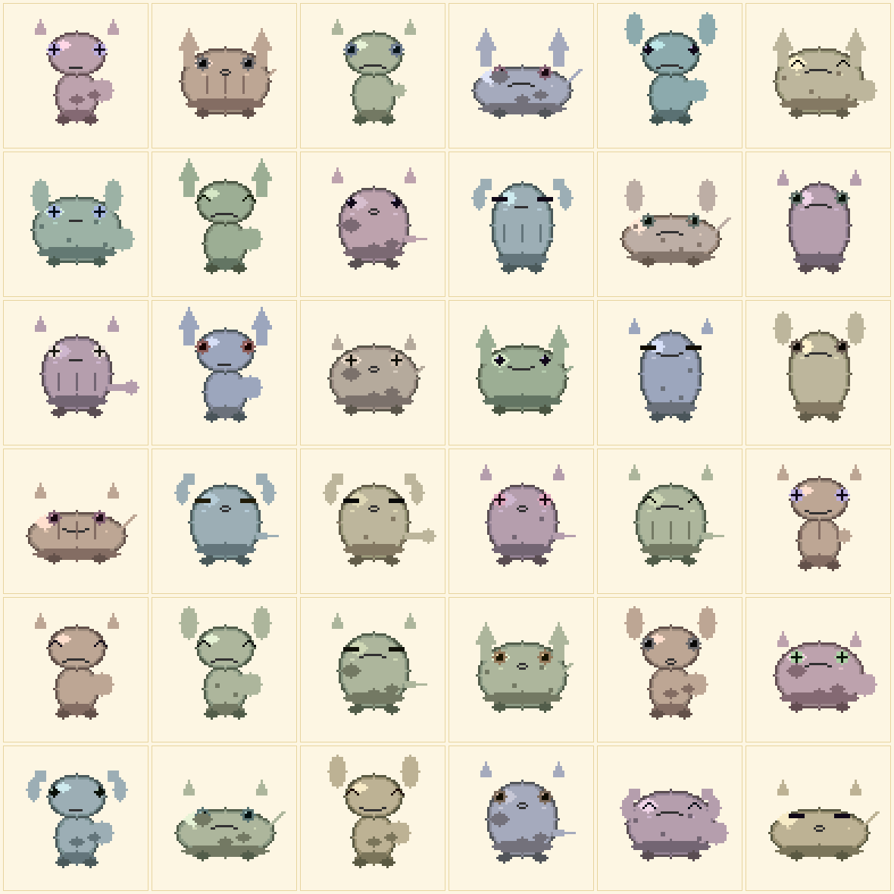
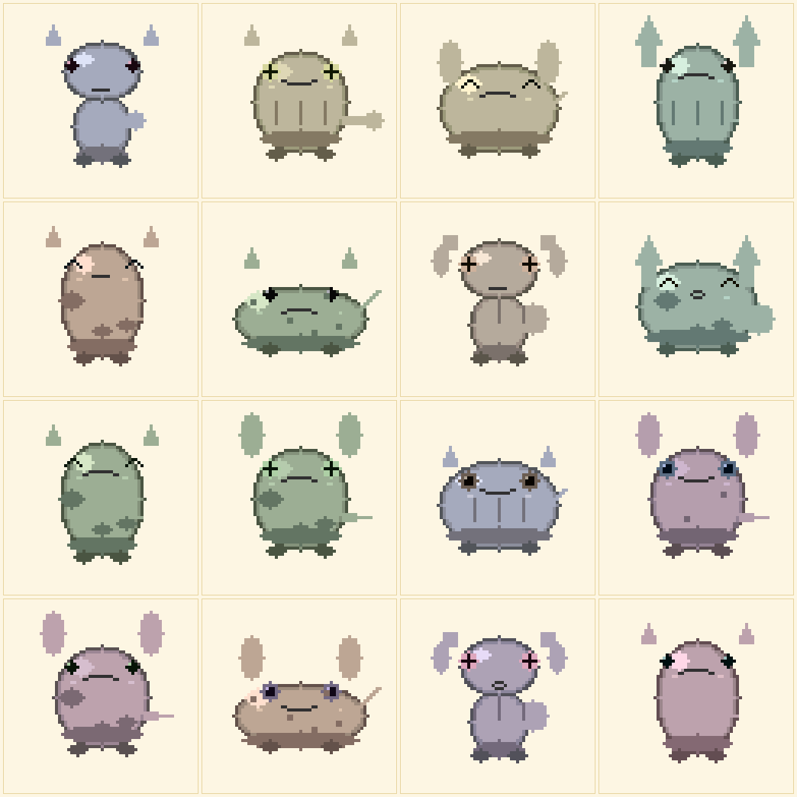
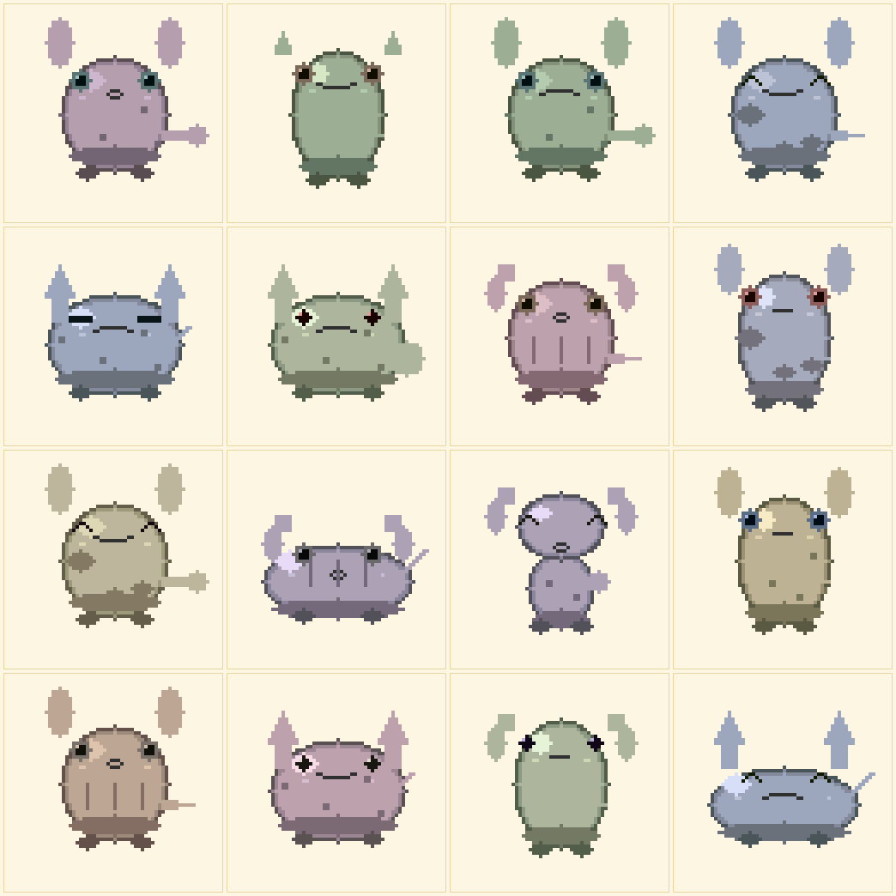

# Pet art previews

Live render samples for browsing the current state of the pet art
*without* flashing a device. Generated by `sprite_forge/preview.py` and
`sprite_forge/random_grid.py`, which mirror the on-device renderer
(`firmware/components/renderer/renderer.c::compose_pet`) byte-for-byte.

GitHub renders the PNGs below inline — open this file in the web UI to
view from anywhere.

## Current gene space

| Layer | Variants |
|-------|----------|
| Body  | chubby, pear, round, tall, wide (**5 shapes**) |
| Eyes  | dot, happy, round, sleepy, star (**5 shapes**) |
| Mouth | frown, open, round, smile (**4 shapes**) |
| Ears  | floppy, pointy, round, tuft (**4 shapes**) |
| Tail  | long, puff, short, spike (**4 shapes**) |
| Pattern | blank, patches, spots, stripes (**4 shapes**) |
| Body palette | 16 hand-authored pastel hues |
| Eye palette  | 16 hand-authored saturated iris colors |

## Variety showcase

36 random pets at seed=42 (all 8 gene bytes randomised per cell):



## Grid samples

Two reproducible 4×4 grids at known seeds:




## Single-pet examples (one of each body shape)

| Pet | Genes | Visual |
|-----|-------|--------|
| Chubby blush-pink | `0,5,1,8,2,1,0,3`  |  |
| Pear plum         | `3,8,4,12,3,2,1,1` |  |
| Round warm brown  | `1,11,0,3,4,3,1,2` |  |
| Tall mint sage    | `2,4,3,5,1,3,0,4`  |  |
| Wide peach        | `4,2,3,10,0,3,2,0` |  |

## Regenerating

```sh
# Latest 36-pet showcase
python3 sprite_forge/random_grid.py --seed 42 --grid 6 --scale 3 \
    --out docs/previews/showcase_36_pets.png

# 4×4 grids
python3 sprite_forge/random_grid.py --seed 0 --grid 4 --scale 4 \
    --out docs/previews/grid_seed_0.png

# A specific pet
python3 sprite_forge/preview.py --genes 0,5,1,8,2,1,0,3 --scale 8 \
    --out docs/previews/single_chubby_pink.png
```

Commit the updated PNGs and push — they'll show up in this README via
the GitHub web UI.
