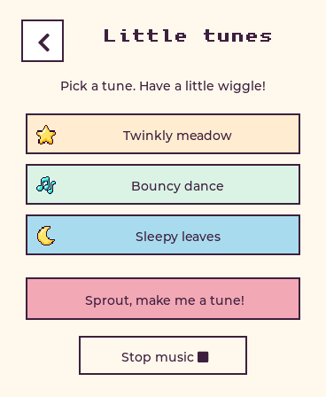

# Audio auditions

All `.wav` files are mono PCM16 at 16 kHz. Local effect/tune files come from the same C synthesizer compiled into the ESP, before hardware volume scaling.

- Different snacks: [apple](apple.wav), [toast](toast.wav), [cookie](cookie.wav)
- Play: [star](star.wav), [bubble](bubble.wav), [ball bounce](bounce.wav), [found you](found.wav)
- Rewards: [sticker](sticker.wav), [room gift](gift.wav)
- Offline tunes: [Twinkly meadow](tune-0.wav), [Bouncy dance](tune-1.wav), [Sleepy leaves](tune-2.wav)
- Real Haiku composition: [Happy Little Day audio](pet-music-live-tune.wav), [voice introduction + tune](pet-music-live-reply.wav), [note pattern](pet-music-live-score.json), [MIDI export](pet-music-live-tune.mid)

Regenerate local sound auditions with `scripts/test_audio.sh`. Export a compatible note pattern with `python3 scripts/export_pet_tune.py score.json output.mid`. The MIDI instrument depends on the player's sound bank; the WAV is the pet's exact synthesized sound.
