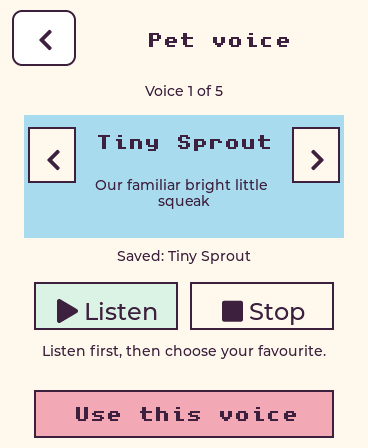

# Pick a voice for your pet

Open **Options → Voice**, browse with the arrows and tap **Listen** to audition.
**Stop** cancels playback. **Use this voice** saves the selection; Back leaves the
saved choice alone. The saved voice appears below the browsing card.

| Choice | Character of the voice | Local Kokoro settings |
| --- | --- | --- |
| Tiny Sprout | Familiar bright creature voice | af_heart, speed 1.12, pitch +6.5 |
| Sunny | Bouncy and playful | af_bella, speed 1.10, pitch +5 |
| Soft cloud | Gentle, softly squeaky | af_sky, speed 1.02, pitch +4 |
| Warm story | Warm and friendly; an option for Osono | bf_emma, speed 1.03, unchanged pitch |
| Calm & low | Low and calm; an option for Larry | bm_george, speed 1.00, unchanged pitch |

The choice belongs to the saved pet on that device. It survives reboot and
changing the character artwork. A fresh pet starts with Tiny Sprout. Existing
saves also retain Tiny Sprout unless you choose another voice. Voices are freely
available, with no reward unlock required.

The selection applies to spoken replies, idle remarks, care reactions, tune
introductions and that pet's turns in multiplayer chat. The other pet keeps its
own choice. Text personality and the pet's Haiku model are unchanged. Ordinary
Butler voices and accounts are unaffected.

Listen uses a fixed sample synthesized by the Mac mini's installed Kokoro server.
It doesn't call Haiku or touch conversation history or memory. Wi-Fi and a ready
voice server are required; offline and synthesis failures show a retry message.
Mute and volume still apply. Preview requests carry an identity so cancelled or
superseded responses are discarded. Browsing, Stop, Back, BOOT and PWR cancel the
preview; BOOT can then begin a normal conversation using the saved choice.

## Storage and protocol

The schema-1 Pet structure is unchanged. Previously unused inventory byte 9 stores
160 plus the stable preset index (0–4). Invalid/unmarked values fall back to 0.
Saves are transactional: a failed NVS write preserves the old in-memory choice.
Reset clears the marker. Older firmware ignores the byte without losing progress.

Normal voice requests include a top-level `voice_preset` ID, separate from the
brain's pet snapshot. Multiplayer profiles carry the same ID, which the gateway
removes from the dialogue prompt. See claude-esp/PROTOCOL.md for audition messages.
Keep the order and IDs in pet_state.c and esp_gateway/pet_voices.py stable.

## Validation and deployment

- Host UI/gameplay tests pass in direct and 40-row partial refresh modes. Tests
  exercise browsing, audition without saving, mute/zero volume, offline feedback,
  save failure, persistence, leaving the picker, and preservation of pet progress.
- 97 gateway tests pass locally and in the deployed container: all presets, normal and proactive replies, microphone
  turns, ordinary Butler isolation, fixed-text previews, authentication, invalid
  presets, cancellation during synthesis/playback and distinct multiplayer voices.
- All five installed Kokoro voices produced valid 16 kHz mono audio. Local audio
  examples and measured durations are in `previews/voice-choice-v1/`.
- Firmware builds successfully: `0x29d0a0` bytes, with `0x62f60` bytes (about
  396 KiB, 13%) free in the app partition. **Not flashed in this change.**

Gateway commit `ac0a195` is deployed on Ron's Mac mini. No Butler backend or model
configuration changes were needed. The authenticated live preview check uses an
isolated socket; it does not send audio to the physical devices or alter their
saved pets. All five authenticated previews and cancellation passed; see
`previews/voice-choice-v1/live-check.json`. Run `integrations/scripts/check_voice_choices.py` inside the gateway.

Restore the previous firmware using tag `pet-chat-v1` (`c222706`), keeping NVS.
The previous gateway is `a57cad4`; its image is backed up as
`esp-gateway:before-voice-choice` and changed source files are under
`~/voice-choice-backup` on the mini. Preserve the gateway's environment and
playdate database when rolling back. Deploy the gateway before the new firmware.

